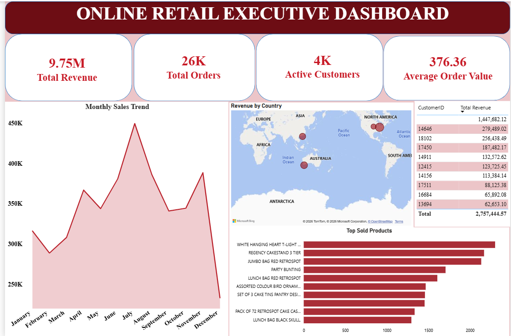

# 🛒 Online Retail Customer Analytics & Revenue Performance

## 📌 Executive Summary
This project delivers an end-to-end business intelligence solution to analyze customer buying patterns, revenue growth, and transaction dynamics for an online retail business. By processing transactional data through Python, executing analytical business queries via SQL, and designing an interactive Power BI dashboard, this project transforms raw transactional data into actionable insights for business decision-making.

---

## 🛠️ Tech Stack & Workflow
* **Python (Pandas, Matplotlib/Seaborn):** Exploratory Data Analysis (EDA), handling missing customer IDs, filtering returns/cancellations (negative quantities/prices), and data transformation.
* **SQL:** Structured analytical queries evaluating customer lifetime value, top-performing product categories, purchase frequency, and monthly revenue trends.
* **Power BI:** Interactive multi-page dashboard featuring high-level KPIs, sales performance breakdowns, and customer segmentation visuals.

---

## 📈 Power BI Dashboard Preview


---

## 📊 Project Structure
```text
├── online_retail_analysis.ipynb   # Data cleaning, EDA, and ETL pipeline
├── online_retail_analysis.sql     # SQL scripts for analytical business queries
├── Online_Retail Analysis.pbix    # Interactive Power BI Dashboard
└── README.md                      # Project documentation
